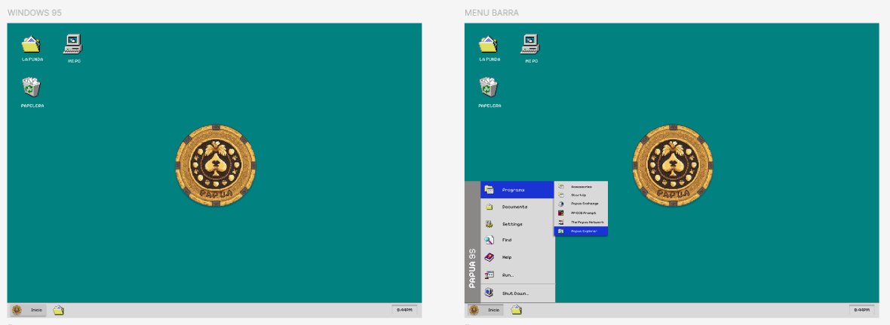
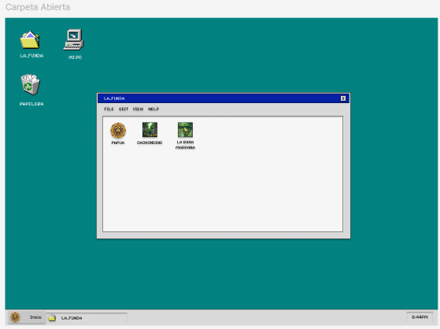
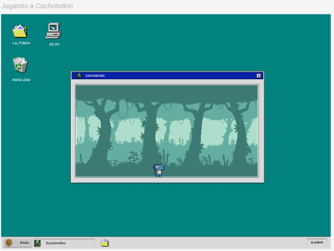
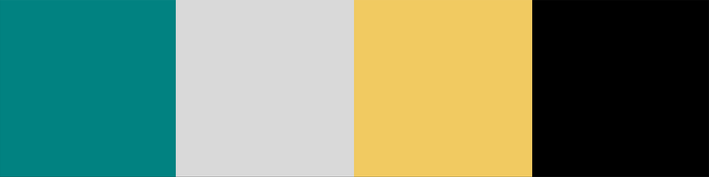

<h1>Papua95</h1>

 
<h2>📖 Explicación idea del proyecto</h2>

  
**Papua95** es una colección de videojuegos con temática “retro” originales o variaciones de otros ya creados, pero con contenido diferencial. Todo esto en una recreación de la interfaz gráfica de Windows 95, combinando elementos y ofreciendo la  interactividad del mismo a su vez cambiando el contenido por uno más humorístico o algún que otro “easter egg” de nosotros los creadores sin que se pierda la seriedad de la recreación.

 

 

<h2>🎯 Nuestros Objetivos</h2>

  
### **1. Recrear Fielmente la Interfaz de Windows 95**
Nuestro principal objetivo es ofrecer una experiencia auténtica y nostálgica de Windows 95 en un entorno web moderno. Para lograrlo, nos enfocamos en el **diseño detallado**, buscando replicar elementos icónicos como el Menú Inicio, el escritorio, las ventanas redimensionables y los diálogos de sistema. 
Asegurando a su vez que estos elementos tengan **interactividad**, para permitir a los usuarios interactuar con la interfaz como lo harían en un sistema operativo real (arrastrar ventanas, hacer clic en el icono de Cachondino). También es importante mantener esa **estética retro**, ya sea manteniendo la paleta de colores, tipografías y efectos visuales propios de los años 90.

### **2. Desarrollar juegos retro con nuestro toque personalizado**
Queremos ofrecer una colección de juegos retro que combinen la nostalgia con mecánicas innovadoras. Haciendo **juegos clásicos reinventados**, creando variantes de juegos populares como el dinosaurio de Google, Snake o Buscaminas, añadiendo elementos únicos y desafíos nuevos.
Siguiendo una **estética pixelada** utilizando gráficos en 8 y 16 bits para mantener la esencia retro, en juegos que serán simples, pero adictivos.

### **3. Implementar un sistema de puntuaciones**
Para fomentar la competencia y la rejugabilidad, nos proponemos:
- **Guardar puntuaciones**: Utilizar Firebase Firestore para almacenar los resultados de los jugadores de manera segura y eficiente.
- **Tabla de líderes**: Mostrar los mejores puntajes por juego, permitiendo a los usuarios competir por el primer lugar.

### **4. Ofrecer una Experiencia Inmersiva**
Buscamos que los usuarios se sientan transportados a los años 90 mediante:
- **Efectos visuales**: Emular una pantalla CRT con filtros CSS.
- **Sonidos auténticos**: Integración de efectos de sonido y música retro, como los sonidos de inicio de Windows 95 o melodías en 8 bits.
- **Easter eggs**: Esconder detalles humorísticos y referencias culturales de los creadores para sorprender a los usuarios.

 

<h2>🌐 Tecnologías Usadas</h2>

  
### **Frontend**
- **React**: Utilizamos React como la base de nuestra interfaz de usuario. React nos permite crear componentes reutilizables y gestionar el estado de la aplicación de manera eficiente, lo que es esencial para simular la interfaz modular de Windows 95.
- **React95**: Para lograr una recreación auténtica de la interfaz de Windows 95, utilizamos la librería **React95**. Esta librería proporciona componentes preestilizados (como ventanas, botones, menús y barras de herramientas) que imitan fielmente el diseño clásico de Windows 95, acelerando el desarrollo y asegurando la coherencia visual.
- **Tailwind CSS**: Para estilos personalizados y un diseño responsive, empleamos **Tailwind CSS**. Tailwind nos permite aplicar estilos directamente en el markup mediante clases utilitarias, lo que agiliza el desarrollo y facilita la creación de diseños consistentes y modernos sin perder la estética retro.

### **Desarrollo de Juegos**
- **Canvas**: Para los juegos retro, utilizamos Canvas, una API de gráficos en 2D integrada en HTML5. Canvas nos permite dibujar gráficos, animaciones y gestionar interacciones directamente en el navegador, lo que es ideal para juegos simples como el clásico Snake, el dinosaurio de Google o un Buscaminas.
- **Godot**: Para los juegos más complejos, Godot es una herramienta potente y flexible que nos permite crear juegos 2D y 3D con lógica avanzada. Exportamos los juegos desarrollados en Godot a formatos compatibles con la web (como WebAssembly) para integrarlos en nuestro proyecto.

### **Backend y Base de Datos**
- **Firebase Firestore**: Base de datos NoSQL en tiempo real utilizada para almacenar y gestionar las puntuaciones de los jugadores. Firestore nos permite guardar datos de manera escalable y sincronizarlos en tiempo real, lo que es ideal para la tabla de líderes.
  

 

 
<h2>📈 Diagramas</h2>

  

 
<h2>💻Pagina Web</h2>
 

  
 
<h3>💭Mockup</h3>

  En esta captura, se muestra el escritorio donde se recrea con algunos cambios la estética clásica de Windows 95. También se observa el Menú Inicio desplegado con las opciones típicas.

  
  
  Esta captura muestra una carpeta abierta, los usuarios pueden navegar por directorios virtuales simulando la experiencia clásica.
  
  

  Esta captura muestra un juego abierto, los usuarios pueden jugar en la web simulando la experiencia clásica.
  
  
  
  
 

 
 
<h3>🎨Paleta De Colores</h3>

 
 
 
 

 
 
<h3>👀Logo</h3>

 

 
 
<h3>🔗Funcionalidades Web</h3>

   
1. **Interfaz de Windows 95**: Menú Inicio, ventanas, escritorio.
2. **Juegos Retro**:
   - Cachondino 2 Definitive Edition
   - La rana marrana
3. **Sistema de Puntuaciones**:
   - Guardar puntuaciones en tiempo real.
   - Tabla de líderes por juego top 10.
4. **Efectos Visuales/Sonidos**: CRT filter, sonidos de Windows 95.
 
 
 

 

 
<h2>Roadmap/Trello/Gantt</h2>

